# API Documentation

## Table of contents
- [API Documentation](#api-documentation)
  - [Table of contents](#table-of-contents)
  - [Fairness Analysis in Unstructured Text and Images](#fairness-analysis-in-unstructured-text-and-images)
    - [Unstructured Text:](#unstructured-text)
    - [Images:](#images)
  - [Fairness Analysis and Mitigation in Structured Data](#fairness-analysis-and-mitigation-in-structured-data)
    - [Fairness Analysis:](#fairness-analysis)
    - [Fairness Mitigation:](#fairness-mitigation)
    - [Individual Fairness:](#individual-fairness)
  - [Fairness Audit and Monitoring](#fairness-audit-and-monitoring)
    - [Decisive Audit:](#decisive-audit)
    - [Generic Audit:](#generic-audit)
  - [Workbench APIs](#workbench-apis)
      - [Bug Fix](#bug-fix)

## Fairness Analysis in Unstructured Text and Images

### Unstructured Text:
**Description:** Assess the fairness of unstructured text that evaluates bias levels (High/Medium/Low/Neutral). It also identifies the affected group and the type of bias (e.g., Historical, Confirmation Bias).

**Endpoint:** /api/v1/fairness/analysis/llm <br>

**Payload:**  
1. response: Text
2. evaluator: GPT_4O (Currently supporting only GPT_4O)<br>

**Response:** Bias analysis of Text with Bias Type and Bias Score.
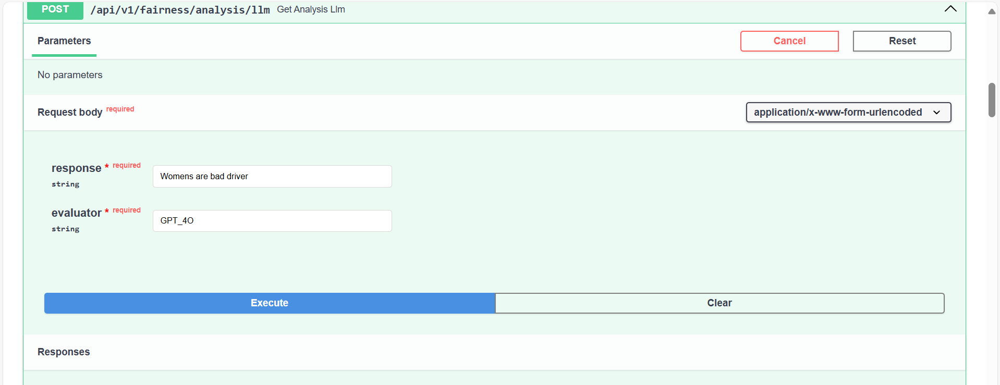
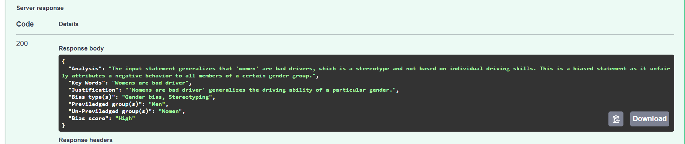

### Images:
**Description:** Assess the fairness of images given the context of the image that evaluates bias levels (High/Medium/Low/Neutral). It also identifies the affected group and the type of bias. A context is necessary as it will guide the evaluation process, ensuring that the image is analyzed in relation to the specific situation or message it is meant to convey.

**Endpoint:** /api/v1/fairness/analysis/image<br>

**Payload:**  
1. prompt: Description of an image.
2. Image: Image for which bias needs to be analyzed
3. evaluator: GPT_4O (Currently supporting only GPT_4O) <br>
   
**Response:** Bias analysis of image with the bias score and bias type.<br>

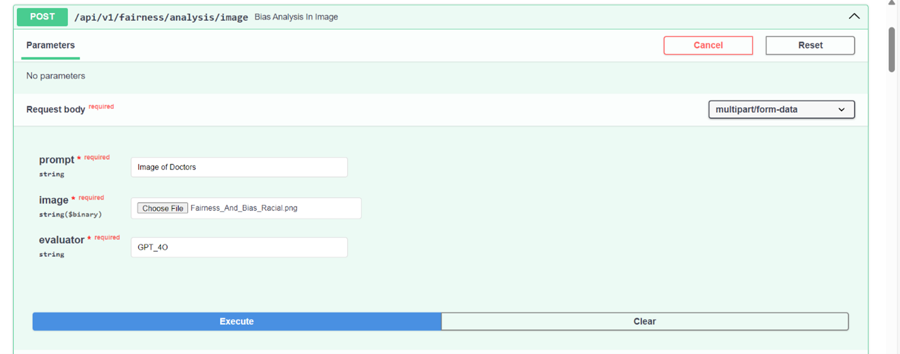
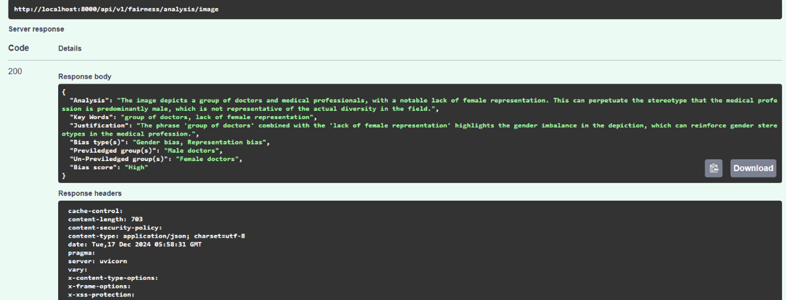


## Fairness Analysis and Mitigation in Structured Data

### Fairness Analysis:
**Description:**
To analyze a bias in a binary classification dataset both in pretrain and posttrain scenario.<br>

**Endpoint:** /api/v1/fairness/Analyse <br>

**Payload:**  
1. biasType: PRETRAIN/POSTTRAIN (Provide the bias type based on your requirements. 'Pretrain' refers to bias analysis conducted before training the model, and it does not include predicted labels. 'Posttrain' refers to bias analysis performed after training the model, which includes the model's predicted labels.)
2. methodType: ALL (Provide the method types for metric scores, such as disparate impact, statistical parity difference, base rate, and others. For more information about metrics, visit [AIF360](https://aif360.readthedocs.io/en/stable/modules/generated/aif360.metrics.BinaryLabelDatasetMetric.html#aif360.metrics.BinaryLabelDatasetMetric), [HolisticAI](https://holisticai.readthedocs.io/en/latest/reference/bias/metrics.html))
3. taskType: CLASSIFICATION (Currently supporting only classification)
4. Label: Mention the target column name to predict. 
5. predLabel: Add prediction label. Default is “labels_pred”. This is required for POSTTRAIN. 
6. FavourableOutcome: A result that benefits a group or individual, such as approval or selection, in a decision-making process.
7. ProtectedAttribute: A characteristic (e.g., race, gender, age) legally protected from discrimination in decision-making.
8. Privileged:  A group that typically receives more favorable outcomes or treatment due to certain attributes.
9. File: Upload the dataset. <br>
    
**Response:** Response: Response are the various metrics like Statistical parity, Disparate Impact which can help us identify the bias in the dataset.<br>

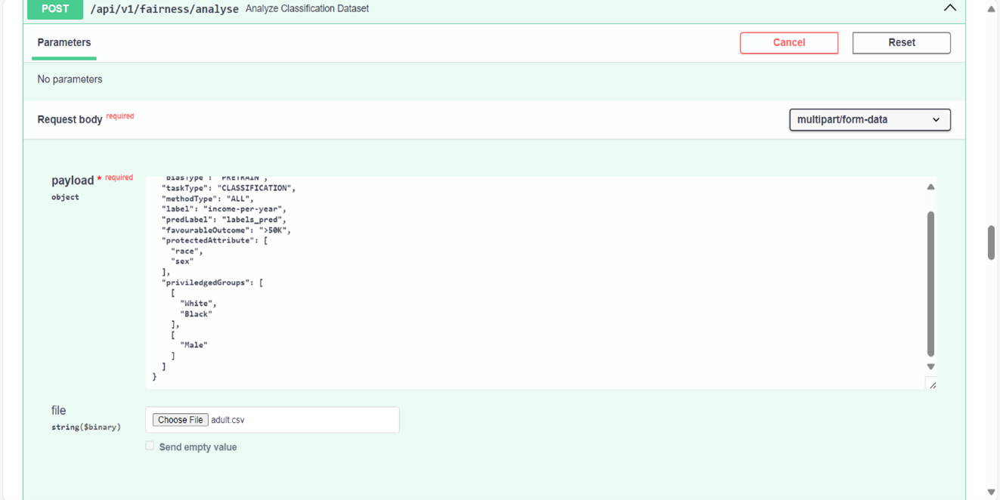
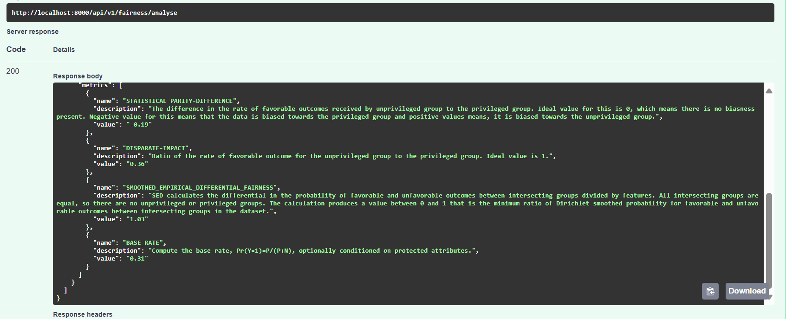

### Fairness Mitigation:
**Description:**
Mitigation in bias analysis refers to strategies or techniques aimed at reducing or eliminating bias in machine learning models, ensuring that decisions are fair and equitable across different groups using technique reweighing. Reweighing is a specific mitigation technique where the training data is adjusted by altering the weights of instances, typically by giving more weight to underrepresented or disadvantaged groups, to balance the influence of the data on the model's predictions. <br>

**Endpoint:** /api/v1/fairness/pretrainMitigate <br>

**Payload:**  
1. MitigationType: PREPROCESSING (Curretnly supporting only preprocessing i.e before training the model.)
2. MitigationTechinque: REWEIGHING (Currently supporting only reweighing. To read more about reweighing, visit [AIF360](https://aif360.readthedocs.io/en/stable/modules/generated/aif360.algorithms.preprocessing.Reweighing.html#aif360.algorithms.preprocessing.Reweighing))
3. taskType: CLASSIFICATION (Currently supporting only classification)
4. Label: Mention the column name of ground truth. 
5. FavourableOutcome: A result that benefits a group or individual, such as approval or selection, in a decision-making process.  
6. ProtectedAttribute: A characteristic (e.g., race, gender, age) legally protected from discrimination in decision-making.
7. Privileged:  A group that typically receives more favorable outcomes or treatment due to certain attributes.
8. File: Upload the dataset. 
**Response:** You will get a mitigated data which can be downloaded using the api **/api/v1/fairness/download/mitigatedData/{fileName}**.
Replace the file name with the mitigated_data_file_name from the response.

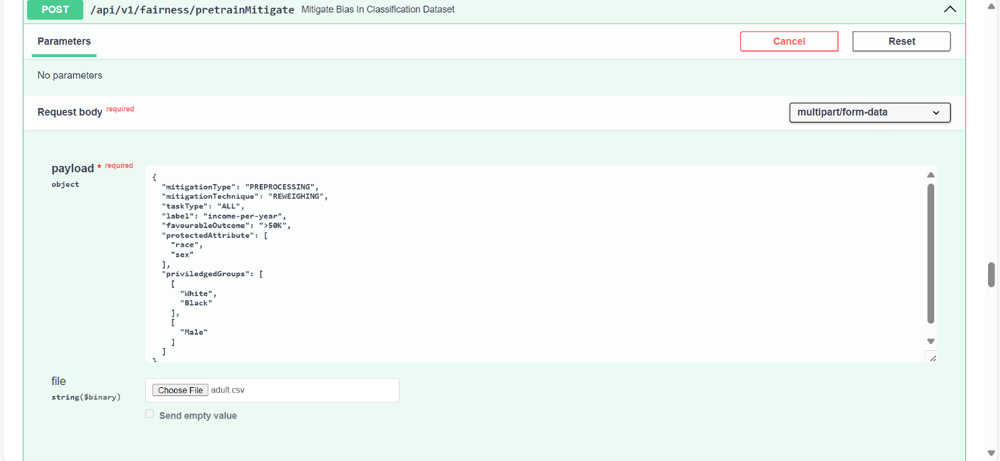

### Individual Fairness:
**Description:**
Individual fairness ensures that similar individuals are treated similarly by a model. The metric used to measure this is consistency, which evaluates how similarly a model predicts outcomes for similar individuals or cases. <br>

**Endpoint:**  /api/v1/fairness/individualMetrics <br>

**Payload:**  
1. label: ground truth or prediction label
2. k: number of neighbors. <br>
   
**Response:** Consistency score which indicates how simlar the instances are.

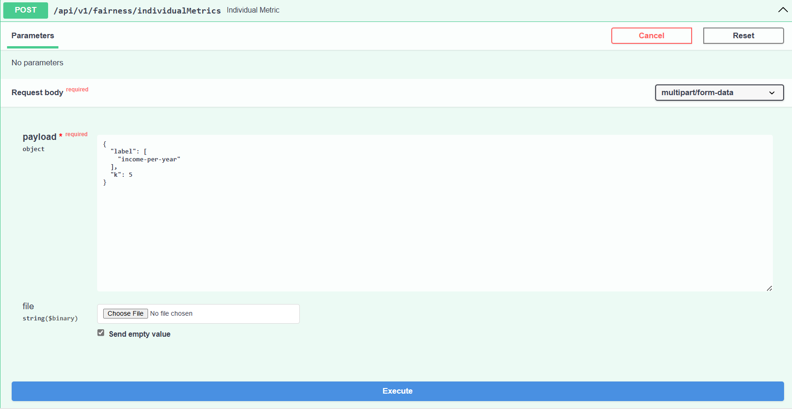
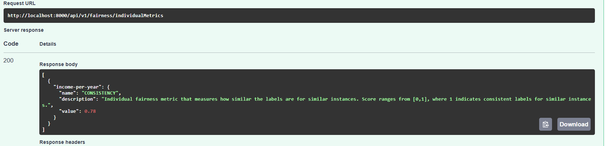

## Fairness Audit and Monitoring

**Background**
Generative AI generates unstructured data. With capabilities like RAG, its now being used for making decisions in binary classification tasks as well. Based on the wide nature of the use-case, we have solution on two types of approaches. 
1. Decisive usecase
2. Generic usecase

**Decisive usecase:**
Decisive solutions or classification solutions where there is a decision . Decisive solutions or classification solutions where there is a decision is made like loan approvals etc., based on set of features and rules involved. In these cases, features importance scores are to be calculated for each decision and stored. Also, the distribution of success rates, population of sub-groups involved vs categories are also recorded. Using periodic audits or live dashboards, the success rate distribution is cross-checked to ensure fairness in the system. When there are indicators of bias like system is mostly favoring a single or few groups, the audit team would cross check the results with the explanations recorded and verify if they are false alarms or an actual bias in system which would trigger further investigation. <br>

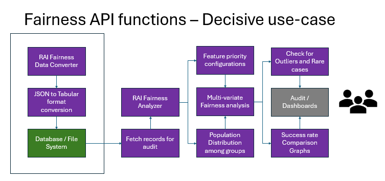

**Generic usecase:**
If the AI model is not involved in any decision making instead it generates some text or image or any content, like summarization tasks etc., we will be monitoring the outputs using our prompt classification tool. This would convert the unstructured out put to structured output which can be used for fairness analysis. This will contain the bias analysis, indicators, affected groups, type of bias and more details can also be added based on use case requirements. Now the bias distribution of the generated content can be monitored and audited to keep check of the generated content. As the bias analysis using the prompt template is the key, we additionally recommend to use  chain-of-thoughts and chain-of-verification to ensure that the analysis done is as accurate as possible.

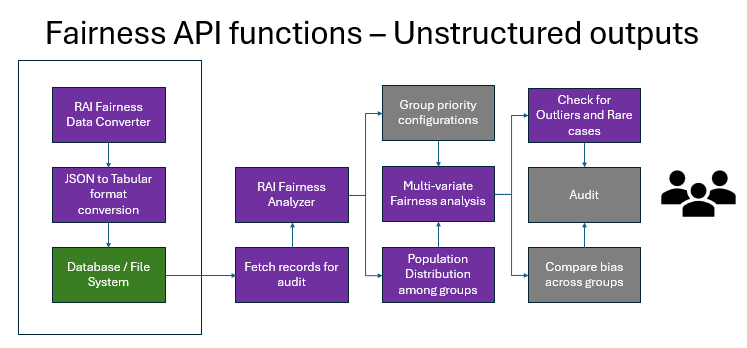

**Generic Monitoring Implementation**
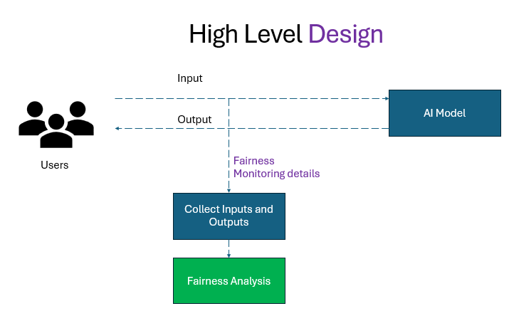

In the above flow diagram, our API (represented by the green box) will collect the responses over time, perform a bias analysis, and generate a comprehensive report with various visualizations and insights


### Decisive Audit:
**Description:**
The API will calculate the success rate based on the collected data and generate a detailed report that includes insights, and visual representations.

**Endpoint:** /api/v1/fairness/analyse/success_rate <br>

**Payload:**  
1. label: ground truth or prediction column.
2. favourableOutcome: Mention favorable outcome for the selected label.
3. Categorical_attribute: Name of the categorical attribute for which success_rate needs to be calculated.
4. File: Structured data that needs to be monitored for the bias. <br>
   
**Response:** The API will calculate the success rate score for each combination of categorical attributes and generate a comprehensive report. The report can be downloaded through the provided endpoint. **/api/v1/fairness/analyse/success_rate/download/{filename}**

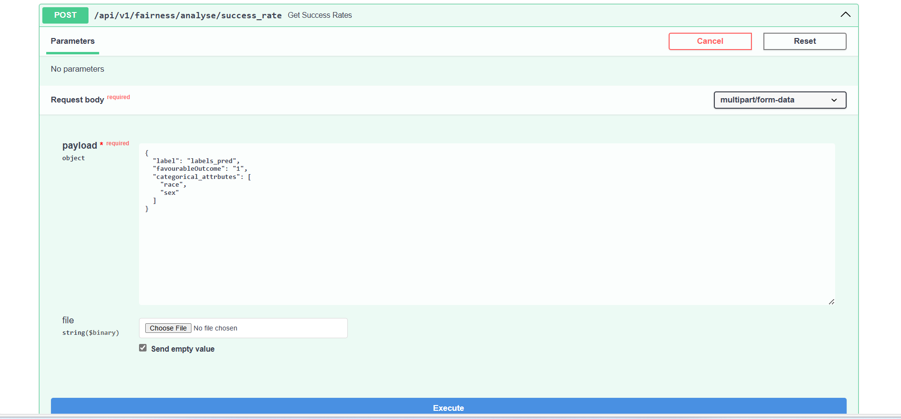
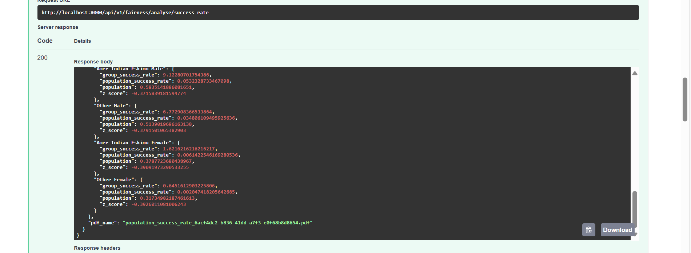

### Generic Audit:
**Description:**
The API will analyze the bias in the collected responses over time and generate a comprehensive report.

**Endpoint:** /api/v1/fairness/audit/fairness_classifier <br>

**Payload:**  
1. prompt: Name of the column which contains the text
2. File: file containing all the text in a single column for which bias needs to be analyzed.<br>
   
**Response:** Bias analysis of each record which gives bias_score, bias_type in csv format, also it returns pdf report containing visual representation. To download the csv and pdf use the endpoint **/api/v1/fairness/audit/fairness_classifier/download/{filename}**, 

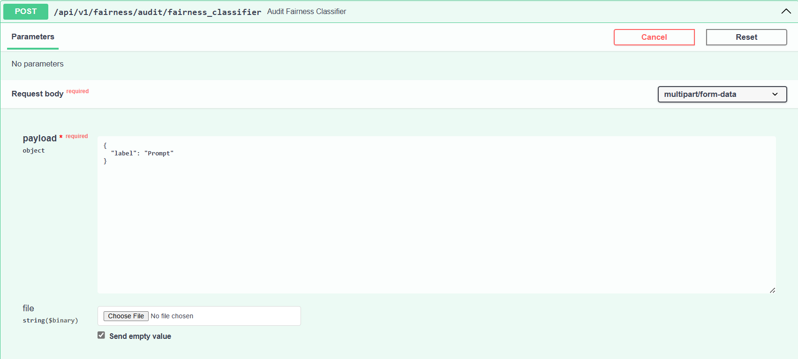

## Workbench APIs
These APIs are required for the workbench (UI) and are universal, meaning a single API can perform various operations such as analysis on unstructured data, structured data, auditing, monitoring, and more. They provide all the core functionalities of the aforementioned APIs. There are two main APIs that need to be integrated into the workbench.

**Endpoint 1:** /fairness/wrapper/batchId <br>

**Payload:**  
1. BatchId: Entered BatchId which can be generated from workbench backend(model-detail-repo).<br>
   
**Response:** The api will perform the required operation on the basis of batchId like analysis, mitigation etc.

**Endpoint 2:** /fairness/wrapper/download <br>
This api will download the report once the operation has completed successfully.

**Payload:**  
1. BatchId: Entered same BatchId which is used in /**fairness/wrapper/batchId** endpoint<br>
   
**Response:** Report for corresponding operations.

#### Bug Fix
- Users who are using UI may experience problems downloading reports for analyze and audit functions when connected to MongoDB.
- Add the following code block in the `read_file` function within the MongoDB block, just before the return statement:

```python
if file_metadata.content_type == "application/pdf":
    file_name = f"file_{str(unique_id)}.pdf"
    extension = "pdf"
    return {
        "data": file_content,
        "name": file_name,
        "extension": extension,
        "contentType": file_metadata.content_type
    }
  ```


**Note:** One required the following services to run the workbench apis 
1. Reporting Tool: For report generation.
2. File-Storage: For file management, if connected to Cosmos DB, a subscription to Azure Blob Storage is required. However, if MongoDB is used, this service is not necessary.


